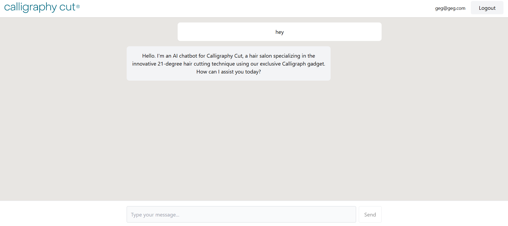

# Calligraphy Cut Chatbot

A modern web application for showcasing and working with Calligraphy Cut styles and techniques. This project demonstrates a full-stack implementation with React frontend and Python backend, fully containerized with Docker.

## 🚀 Tech Stack

### Frontend
- **Vite** - Next generation frontend tooling
- **React** - UI component library
- **TailwindCSS** - Utility-first CSS framework

### Backend
- **Python** - Core programming language
- **FastAPI** - Modern, fast web framework for API development
- **GROQ API** - Integration for AI-powered text processing

### Infrastructure
- **Docker** - Containerization for consistent environments
- **Docker Compose** - Multi-container orchestration
- **Azure Container Apps** - Cloud hosting for containerized applications
- **Azure Container Registry** - Private registry for Docker images
- **GitHub Actions** - CI/CD automation

### Important Note
**Groq API was used instead of OPENAI's API KEY because the former is entirely for free and was better for demonstration purposes but the same method is used for connecting any of them**

## ☁️ Azure Deployment

This application is deployed on Azure using container-based services:

### Architecture
- **Azure Container Registry** stores Docker images for both frontend and backend services
- **Azure Container Apps** runs the containerized applications in a managed environment
- **GitHub Actions** provides CI/CD pipelines for automated deployments

### CI/CD Pipeline
The repository includes GitHub Actions workflows that automatically:
1. Build new Docker images when changes are pushed to the main branch
2. Push these images to Azure Container Registry with the "latest" tag
3. Update the corresponding Container Apps to use the newly built images

This ensures that any modifications to the codebase are automatically deployed to the live environment without manual intervention.

### Live Demo
You can access the live application at:
[Frontend Application](https://frontend-calligraphy-cut-chatbot.kindpebble-7abcd71b.germanywestcentral.azurecontainerapps.io)

## 📦 Installation

Choose from three installation methods:

### 1. Docker (Recommended)

The fastest way to get started with zero configuration:

```bash
# Clone the repository
git clone https://github.com/blanconaldo/calligraphy-cut-chatbot.git

# Navigate to project directory
cd calligraphy-cut-chatbot

# Create .env file for GROQ API key (in backend directory)
echo "GROQ_API_KEY=your_api_key_here" > backend/.env

# Build and run with Docker Compose
docker-compose up
```

The application will be available at:
- Frontend: http://localhost:5173
- Backend API: http://localhost:8001

### 2. Direct Clone & Manual Setup

```bash
# Clone the repository
git clone https://github.com/blanconaldo/calligraphy-cut-chatbot.git

# Navigate to project directory
cd calligraphy-cut-chatbot

# Frontend setup
cd frontend
pnpm install
pnpm dev

# In another terminal, backend setup
cd backend
python -m venv venv
source venv/bin/activate  # On Windows: venv\Scripts\activate
pip install -r requirements.txt
uvicorn main:app --reload --port 8001
```

### 3. HTTP Download

1. Download the ZIP file from the repository
2. Extract to your preferred location
3. Follow the manual setup instructions above

## 🔧 Configuration

### Environment Variables

Create a `.env` file in the backend directory with:

```
GROQ_API_KEY=your_api_key_here
```

You can get a GROQ API key from [groq.com](https://groq.com).

## 📚 Usage

- Access the web interface at http://localhost:5173
- API documentation available at http://localhost:8001/docs
- Interact with the UI to explore Calligraphy Cut styles and techniques

## 📝 Legal Notice

All Calligraphy Cut logos, trademarks, and brand elements used in this project are for demonstration purposes only. The Calligraphy Cut Company retains all rights to their intellectual property. This project is not affiliated with, endorsed by, or connected to the Calligraphy Cut Company in any official capacity.

## 📖 License

This project is licensed under the GNU GPLv3 License - see the [LICENSE](LICENSE) file for details.

---

Made with ❤️ by Youssef Mohamed